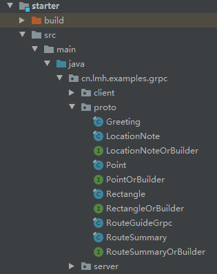
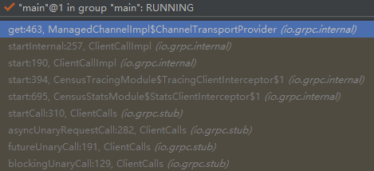
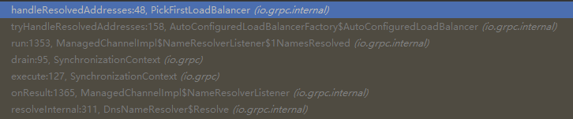
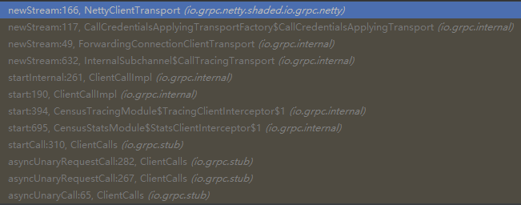

# RPC框架的选择

常见的RPC框架主要分为轻重两种。较轻的框架一般只负责通信，如rmi、webservice、restful、Thrift、Grpc等。较重的框架一般包括完整的服务发现、负载均衡策略等等如BAT三家的Dubbo、brpc、Tars之类。
	
框架选择时个人认为首先要考虑的是框架的历史和项目的活跃程度。一个历史悠久的活跃项目（大概可以至少保证每两到三个月可以有一次小版本的更新）可以保证各种问题早已暴露并修复，让我们可以更专注于我们自己的项目本身，而不是要担心究竟是我们自己的代码有问题还是框架本身就有问题。
	
重量级RPC框架有一个主要问题就是结构复杂，另外主语言之外的代码质量也不太容易保证。个人认为这些重型RPC框架如果想要成功需要有一个活跃的社区，以及一个活跃的开源管理团队。比如我们项目组试用过腾讯的Tars，C++同学表示没有任何问题，然后JAVA同学表示java版本的各种bug，提了好多Bug修改请求至今还挂在github上，而这个项目已经快两年没更新了。
	
轻量级rpc框架中，restful可以被视作标杆。由于restful基于http协议，天然被各种框架支持，而且非常灵活。restful的缺点有两方面，一是过于灵活，缺少根据协议生成服务端和客户端代码的工具，联调往往要花更多的时间；二是大部分序列化基于json或者xml，相对来讲效率不理想。和restful相比，很多轻量级框架都有这样或者那样的缺点，有的缺少跨语言支持（rmi），有的很繁琐（webservice）。个人认为其中相对理想的是Grpc和Thrift。

## Grpc简介

Protobuf是一种google推出的非常流行的跨语言序列化/反序列化框架。在Protobuf2中就已经出现了用rpc定义服务的概念，但是一直缺少一种流行的rpc框架支持。当Http2推出之后，google将Http2和protobuf3结合，推出了Grpc。Grpc继承了Protobuf和Http2的优点，包括：
* 序列化反序列化性能好
* 强类型支持
* 向前/向后兼容
* 有代码生成机制，而且可以支持多语言
* 长连接、多路复用

同时Grpc还提供了简单地服务发现和负载均衡功能。虽然这并不是Grpc框架的重点，但是开发者可以非常容易的自己扩展Grpc这些功能，实现自己的策略或应用最新的相关方面技术，而不用像重型Rpc框架一样受制于框架本身是否支持。

## Grpc与Thrift对比

Thrift是Facebook推出的一种RPC框架，从性能上来讲远优于Grpc。但是在实际调研时发现有一个很麻烦的问题：Thrift的客户端是**线程不安全**的——这意味着在Spring中无法以单例形式注入到Bean中。解决方案有三种：
1.每次调用创建一个Thrift客户端。这不仅意味着额外的对象创建和垃圾回收开销，而且实际上相当于只使用了短链接，这是一个开发复杂度最低但是从性能上来讲最差的解决方案。
2.利用Pool，稍微复杂一点的解决方案，但是也非常成熟。但是问题在于一来要实现服务发现和负载均衡恐怕需要很多额外开发；二来恐怕要创建Pool数量\*服务端数量个客户端，内存开销会比较大。
3.使用异步框架如Netty，可以成功避免创建过多的客户端，但是仍要自己实现服务发现和负载均衡，相对复杂。实际上Facebook有一个基于Netty的Thrift客户端，叫Nifty，但是快四年没更新了。。。

>相比较而言Grpc就友好多了，本身有简单而且可扩展的服务发现和负载均衡功能，底层基于Netty所以线程安全，在不需要极限压榨性能的情况下是非常好的选择。当然如果需要极限压榨性能Thrift也未必够看。

# Grpc入门

## Grpc服务定义

Grpc中有一个特殊的关键字**stream**，表示可以以流式输入或输出多个protobuf对象。注意只有异步非阻塞的客户端支持以stream形式输入，同步阻塞客户端不支持以stream形式输入。

```
syntax = "proto3";  //GRPC必须使用proto3

option java_multiple_files = true;
option java_package = "cn.lmh.examples.grpc.proto";

service RouteGuide {
  // 输入一个坐标，返回坐标和时间(1:1)
  rpc getPoint(Point) returns (LocationNote) {}
  // 输入一个矩形，以stream形式返回一系列点(1:n)
  rpc listPoints(Rectangle) returns (stream Point) {}
  // 以stream形式输入一系列点，返回点的数量和总共花费的时间(m:1)
  rpc recordRoute(stream Point) returns (RouteSummary) {}
  // 以stream形式输入一系列点，以stream形式返回已输入点的数量和总共花费的时间(m:n)
  rpc getPointStream(stream Point) returns (stream RouteSummary) {}
}

message Point {
  int32 latitude = 1;
  int32 longitude = 2;
}
message Rectangle {
  Point lo = 1;
  Point hi = 2;
}
message LocationNote {
  Point location = 1;
  int64 timestamp = 2;
}
message RouteSummary {
  int32 point_count = 1;
  int64 elapsed_time = 2;
}
```

## 依赖和代码生成

由于protoc的Grpc插件需要自己编译，而且存在环境问题。推荐使用gradle或者maven的protobuf插件。实例项目使用了gradle，根目录build.gradle配置如下:

```
plugins {
	id 'java'
	id 'idea'
	id 'wrapper'
}

ext {
	groupId = 'cn.lmh.leviathan'
	proto = [
		version : "3.9.0",
		"grpc" :[
			version : "1.23.0"
		]
	]
}

allprojects{
	apply plugin: 'java'
	apply plugin: 'idea'

	sourceCompatibility=JavaVersion.VERSION_1_8
	targetCompatibility=JavaVersion.VERSION_1_8

	project.group = 'cn.lmh.examples'

	compileJava.options.encoding = 'UTF-8'
}

subprojects{
	repositories {
		mavenCentral()
		mavenLocal();
	};
	configurations {
		compile
	}

	dependencies {
		compile "io.grpc:grpc-netty-shaded:${proto.grpc.version}"
		compile "io.grpc:grpc-protobuf:${proto.grpc.version}"
		compile "io.grpc:grpc-stub:${proto.grpc.version}"

		testCompile group: 'junit', name: 'junit', version: '4.12'
	}
}
```

子项目build.gradle如下：

```
plugins{
    id 'com.google.protobuf' version '0.8.10'   //引入protobuf插件
}

sourceSets{
    main{
        proto {
            srcDir 'src/main/proto' //指定.proto文件所在的位置
        }
    }
}

protobuf {
    generatedFilesBaseDir = "$projectDir/src"   //生成文件的根目录

    protoc {
        artifact = "com.google.protobuf:protoc:${proto.version}"    //protoc的版本
    }

    plugins {
        grpc {
            artifact = "io.grpc:protoc-gen-grpc-java:${proto.grpc.version}" //grpc的版本
        }
    }

    generateProtoTasks {
        all()*.plugins {
            grpc {
                outputSubDir = "java"   //grpc生成文件的子目录
            }
        }
    }
}
```

我们的入门子项目名称叫做starter，配置好build.gradle之后，执行gradlew :starter:generateProto就可以在src/main/java下生成对应的文件：


## 服务端

>无论客户端以异步非阻塞还是同步阻塞形式调用，Grpc服务端的返回都是以异步形式返回。对于异步的请求或者返回，都需要实现Grpc的`io.grpc.stub.StreamObserver`接口。接口有三个方法：
+ `onNext`:表示接收/发送一个对象
+ `onError`:处理异常
+ `onCompleted`:表示请求或返回结束

>当请求来到服务端端时，会异步调用requestObserver的onNext方法，直到结束时调用requestObserver的onCompleted方法；服务端调用responseObserver的onNext把结果返回给客户端，直到调用responseObserver的onCompleted方法通知客户端返回结束。服务端代码如下：
```
import cn.lmh.examples.grpc.proto.*;
import io.grpc.Server;
import io.grpc.ServerBuilder;
import io.grpc.stub.StreamObserver;
import java.io.IOException;
import java.util.concurrent.atomic.AtomicInteger;

public class RouteGuideServer {
    private final int port;
    private final Server server;

    public RouteGuideServer(int port) throws IOException {
        this.port = port;
        server = ServerBuilder.forPort(port).addService(new RouteGuideService())
                .build();
    }

    /** Start server. */
    public void start() throws IOException {
        server.start();
        System.out.println("Server started, listening on " + port);
        Runtime.getRuntime().addShutdownHook(new Thread() {
            @Override
            public void run() {
                RouteGuideServer.this.stop();
            }
        });
    }

    /** Stop server */
    public void stop() {
        if (server != null) {
            server.shutdown();
        }
    }

    /**
     * Await termination on the main thread since the grpc library uses daemon threads.
     */
    private void blockUntilShutdown() throws InterruptedException {
        if (server != null) {
            server.awaitTermination();
        }
    }

    public static void main(String[] args) throws Exception {
        RouteGuideServer server = new RouteGuideServer(8980);
        server.start();
        server.blockUntilShutdown();
    }

    private static class RouteGuideService extends RouteGuideGrpc.RouteGuideImplBase {
        @Override
        public void getPoint(Point request, StreamObserver<LocationNote> responseObserver) {
            LocationNote value = LocationNote.newBuilder().setLocation(request).setTimestamp(System.nanoTime()).build();
            responseObserver.onNext(value);
            responseObserver.onCompleted();
        }

        @Override
        public void listPoints(Rectangle request, StreamObserver<Point> responseObserver) {
            int left = Math.min(request.getLo().getLongitude(), request.getHi().getLongitude());
            int right = Math.max(request.getLo().getLongitude(), request.getHi().getLongitude());
            int top = Math.max(request.getLo().getLatitude(), request.getHi().getLatitude());
            int bottom = Math.max(request.getLo().getLatitude(), request.getHi().getLatitude());
            for(int x = left; x <= right; x++){
                for(int y = top; y >= bottom; y--){
                    Point point = Point.newBuilder().setLongitude(x).setLatitude(y).build();
                    responseObserver.onNext(point);
                }
            }
            responseObserver.onCompleted();
        }

        @Override
        public StreamObserver<Point> recordRoute(StreamObserver<RouteSummary> responseObserver) {
            return new StreamObserver<Point>(){ //返回的是requestObserver
                AtomicInteger pointCount = new AtomicInteger(0);
                final long startTime = System.nanoTime();

                @Override
                public void onNext(Point value) {
                    int count = pointCount.incrementAndGet();
                }

                @Override
                public void onError(Throwable t) {}

                @Override
                public void onCompleted() {
                    RouteSummary result = RouteSummary.newBuilder().setElapsedTime(System.nanoTime() - startTime).setPointCount(pointCount.get()).build();
                    responseObserver.onNext(result);
                    responseObserver.onCompleted();
                }
            };
        }

        @Override
        public StreamObserver<Point> getPointStream(StreamObserver<RouteSummary> responseObserver) {
            return new StreamObserver<Point>(){ //返回的是requestObserver
                AtomicInteger pointCount = new AtomicInteger(0);
                final long startTime = System.nanoTime();

                @Override
                public void onNext(Point value) {
                    int count = pointCount.incrementAndGet();
                    RouteSummary result = RouteSummary.newBuilder().setElapsedTime(System.nanoTime() - startTime).setPointCount(count).build();
                    responseObserver.onNext(result);
                }

                @Override
                public void onError(Throwable t) {}

                @Override
                public void onCompleted() {
                    responseObserver.onCompleted();
                }
            };
        }
    }
}
```

## 客户端

Grpc的客户端有同步阻塞客户端（blockingStub)和异步非阻塞客户端(Stub）两种。同步客户端使用比较方便，但是性能较低，而且不支持stream形式的request;异步客户端性能较高，支持stream形式的request，但是如果想要以同步方式调用需要额外封装。本文将主要以异步为例。

### 异步转同步

由于Grpc的异步客户端性能较高且功能更完整，所以一般都会采用异步客户端。异步客户端接收到的服务端返回也是以`io.grpc.stub.StreamObserver`形式。由于客户端的调用可能是在异步进程中但更可能是在同步进程中，所以就存在一个如何把Grpc异步返回转为同步返回的过程。

一个比较常见的思路是写一个`io.grpc.stub.StreamObserver`实现，里面有一个内置变量保存异步返回的结果，再添加一个阻塞式的`get()`方法，直到返回完成才把所有结果返回。要知道返回是否完成，需要添加一个`Boolean`或者`AtomicBoolean`变量，初始化为`false`，调用`responseObserver.onCompleted()`方法时设置为`true`，这样就可以通过这个变量判断返回是否完成。阻塞`get()`方法最常见的思路是`get()`写一个`while`循环，直到变量值改为`true`才退出循环并返回结果。这种方式的优点是简单直接，任何语言都可以简单实现，缺点是由于使用循环可能CPU占用较高。另一个思路是在仅限于java之类多线程比较完善的语言，如在发现返回没有结束时，将线程挂起，`调用responseObserver.onCompleted()`方法在修改变量的同时唤醒线程。代码如下

```
import io.grpc.stub.StreamObserver;
import java.util.ArrayList;
import java.util.List;
public class CallableStreamObserver<T> implements StreamObserver<T> {
    List<T> values = new ArrayList<T>();
    boolean isCompleted = false;
    Throwable t = null;
    @Override
    public void onNext(T value) {
        this.values.add(value);
    }
    @Override
    public void onError(Throwable t) {
        this.isCompleted = true;
        this.t=t;
        notifyAll();
    }
    @Override
    public synchronized void onCompleted() {
        this.isCompleted = true;
        notifyAll();
    }
    public List<T> get() throws Throwable{
        while(!this.isCompleted){
            synchronized (this) {
                this.wait(60 * 1000);
            }
        }
        if(null != t){
            throw this.t;
        }else{
            return this.values;
        }
    }
}
```

### 客户端代码
```
import cn.lmh.examples.grpc.CallableStreamObserver;
import cn.lmh.examples.grpc.proto.*;
import io.grpc.ManagedChannel;
import io.grpc.ManagedChannelBuilder;
import io.grpc.stub.StreamObserver;

import java.util.Collection;
import java.util.Iterator;
import java.util.List;
import java.util.concurrent.TimeUnit;

public class RouteGuideClient {

    private final ManagedChannel channel;
    private final RouteGuideGrpc.RouteGuideBlockingStub blockingStub;
    private final RouteGuideGrpc.RouteGuideStub asyncStub;

    public RouteGuideClient(String host, int port) {
        this(ManagedChannelBuilder.forAddress(host, port).usePlaintext());
    }

    /** Construct client for accessing RouteGuide server using the existing channel. */
    public RouteGuideClient(ManagedChannelBuilder<?> channelBuilder) {
        channel = channelBuilder.build();
        blockingStub = RouteGuideGrpc.newBlockingStub(channel);
        asyncStub = RouteGuideGrpc.newStub(channel);
    }

    public void shutdown() throws InterruptedException {
        channel.shutdown().awaitTermination(5, TimeUnit.SECONDS);
    }

    public LocationNote getPoint(int lo, int lt, boolean blocking) throws Throwable {
        Point point = Point.newBuilder().setLongitude(lo).setLatitude(lt).build();
        if(blocking) {
            return blockingStub.getPoint(point);
        }else{
            CallableStreamObserver<LocationNote> responseObserver = new CallableStreamObserver<LocationNote>();
            asyncStub.getPoint(point, responseObserver);
            return responseObserver.get().get(0);
        }
    }

    public Iterator<Point> listPoints(int left, int top, int right, int bottom, boolean blocking) throws Throwable {
        Point hi = Point.newBuilder().setLongitude(left).setLatitude(top).build();
        Point lo = Point.newBuilder().setLongitude(right).setLatitude(bottom).build();
        Rectangle rec = Rectangle.newBuilder().setHi(hi).setLo(lo).build();
        if(blocking){
            return blockingStub.listPoints(rec);
        }else{
            CallableStreamObserver<Point> responseObserver = new CallableStreamObserver<Point>();
            asyncStub.listPoints(rec, responseObserver);
            return responseObserver.get().iterator();
        }
    }

    public RouteSummary recordRoute(Collection<Point> points) throws Throwable {
        CallableStreamObserver<RouteSummary> responseObserver = new CallableStreamObserver<RouteSummary>();
        StreamObserver<Point> requestObserver = asyncStub.recordRoute(responseObserver);
        points.stream().parallel().forEach(p -> requestObserver.onNext(p));
        requestObserver.onCompleted();
        return responseObserver.get().get(0);

    }

    public List<RouteSummary> getPointStream(Collection<Point> points) throws Throwable {
        CallableStreamObserver<RouteSummary> responseObserver = new CallableStreamObserver<RouteSummary>();
        StreamObserver<Point> requestObserver = asyncStub.getPointStream(responseObserver);
        points.stream().parallel().forEach(p -> requestObserver.onNext(p));
        requestObserver.onCompleted();
        return responseObserver.get();
    }
}
```

# GRPC代码详解

Grpc将整个组件分为分为三层：Stub、Channel和Transport。
Transport层承担了将字节从网络中取出和放入数据的工作，有三种实现Netty、okHttp、inProgress。gRPC认为Transport层属于内部代码，不保证其API的稳定性。
Channel层是对Transport层功能的抽象，相比Stub层提供更多的功能，比如服务发现和负载均衡都是在这层实现的。
gRPC附带的插件可以从.proto文件直接生成Stub层代码，开发人员通过直接调用Stub层的代码调用RPC服务。

整个Grpc的代码比较多的，封装比较多，相对于interface更喜欢使用abstract class，相对于使用反射更喜欢使用硬编码，与大多数java项目的编码风格有很大差别，阅读起来很不习惯。在源码层面本文将关注下面这些方面：
1.Channel的初始化过程;
2.gRPC中的服务发现;
3.gRPC中的负载均衡
4.Client与Server之间的数据传输

## Channel的初始化过程

通过入门示例可以看到，Channel的初始化过程分三步：
1.调用forTarget方法创建`io.grpc.ManagedChannelBuilder`;
2.配置各种选项，不论如何配置，返回的总是`io.grpc.ManagedChannelBuilder`对象;
3.调用build方法创建`io.grpc.ManagedChannel`。


### `forTarget`方法
感觉Grpc这里设计比较繁琐。`forTarget`方法的实际功能**是把一个url赋值给`io.grpc.ManagedChannelBuilder`内部的`target`变量**，但是过程比较绕。
```
/**
   * Creates a channel with a target string, which can be either a valid {@link
   * NameResolver}-compliant URI, or an authority string.
   *
   */
  public static ManagedChannelBuilder<?> forTarget(String target) {
    return ManagedChannelProvider.provider().builderForTarget(target);
  }
```
`io.grpc.ManagedChannelProvider.provider()`会返回一个`io.grpc.ManagedChannelProvider`实现，然后会调用这个实现的`buildForTarget`方法。有哪些`io.grpc.ManagedChannelProvider`实现是在`io.grpc.ManagedChannelProvider`中以硬编码实现的。
```
private static final class HardcodedClasses implements Iterable<Class<?>> {
    @Override
    public Iterator<Class<?>> iterator() {
      List<Class<?>> list = new ArrayList<>();
      try {
        list.add(Class.forName("io.grpc.okhttp.OkHttpChannelProvider"));
      } catch (ClassNotFoundException ex) {
        // ignore
      }
      try {
        list.add(Class.forName("io.grpc.netty.NettyChannelProvider"));
      } catch (ClassNotFoundException ex) {
        // ignore
      }
      return list.iterator();
    }
  }
```
实际上就根据依赖的jar包不同就只有两个实现，一个netty的，一个okhttp的。因为我们配置里配置的是netty实现,所以就只分析netty实现，okhttp里的实现也是类似的。`io.grpc.netty.NettyChannelProvider`的buildForTarget方法调用的是`io.grpc.netty.NettyChannelBuilder`的`forTarget`方法。
```
public NettyChannelBuilder builderForTarget(String target) {
    return NettyChannelBuilder.forTarget(target);
}
```
而`io.grpc.netty.NettyChannelBuilder`继承自`io.grpc.internal.AbstractManagedChannelImplBuilder`，`forTarget`方法实际上调用了父类的构造函数。
```
@CheckReturnValue
  NettyChannelBuilder(String target) {
    super(target);
  }

@CheckReturnValue
  public static NettyChannelBuilder forTarget(String target) {
    return new NettyChannelBuilder(target);
  }
```
`io.grpc.internal.AbstractManagedChannelImplBuilder`的构造函数主要作用是把参数赋值给`target`变量。
```
protected AbstractManagedChannelImplBuilder(String target) {
    this.target = Preconditions.checkNotNull(target, "target");
    this.directServerAddress = null;
  }
```
### `build`方法
从前文可以看到，实际初始化的`io.grpc.ManagedChannelBuilder`实际上是`io.grpc.netty.NettyChannelBuilder`，他的`build`方法在其父类`io.grpc.internal.AbstractManagedChannelImplBuilder`中。
```
@Override
  public ManagedChannel build() {
    return new ManagedChannelOrphanWrapper(new ManagedChannelImpl(
        this,
        buildTransportFactory(),
        // TODO(carl-mastrangelo): Allow clients to pass this in
        new ExponentialBackoffPolicy.Provider(),
        SharedResourcePool.forResource(GrpcUtil.SHARED_CHANNEL_EXECUTOR),
        GrpcUtil.STOPWATCH_SUPPLIER,
        getEffectiveInterceptors(),
        TimeProvider.SYSTEM_TIME_PROVIDER));
  }
```  
从功能上看`io.grpc.internal.ManagedChannelOrphanWrapper`没有任何作用，`io.grpc.internal.ManagedChannelOrphanWrapper`会为`io.grpc.ManagedChannel`创建弱引用，并被放置到ReferenceQueue中。如果Channel是单例的，那么意义不大；如果客户端被重复创建却没有被关闭，那么ReferenceQueue中会留下相应的引用记录，可能有助于排查问题。

`io.grpc.internal.ManagedChannelImpl`构造方法的几个参数中，除了第一个参数是builder本身，第二个参数是用来创建Tranport的Factory，第三个参数是后台连接重试策略，第四个参数是gRPC的全局线程池，第五个和第七个都是和时间相关的对象，主要用于日志中，第六个是客户端调用时的interceptor。`buildTransportFactory`的实现方法会`io.grpc.netty.NettyChannelBuilder`，会创建一个`io.grpc.netty.NettyChannelBuilder.NettyTransportFactory`。


## 发现服务端

前文的入门示例客户端中直接写了host和port，那么不免让人产生疑问，如果有多个可以提供服务的Server如何处理。。在`io.grpc.ManagedChannelBuilder`中有一个`nameResolverFactory`方法，可以指定如何解析`target`地址，用来发现服务端。

### `nameResolverFactory`方法
这个方法的实现也在`io.grpc.internal.AbstractManagedChannelImplBuilder`中，如果用户有自己的`io.grpc.NameResolve.Factory`实现的话会使用用户的`io.grpc.NameResolve.Factroy`实现，否则会使用`io.grpc.NameResolverRegistry`的默认实现。
```
final NameResolverRegistry nameResolverRegistry = NameResolverRegistry.getDefaultRegistry();

@Override
  public final T nameResolverFactory(NameResolver.Factory resolverFactory) {
    Preconditions.checkState(directServerAddress == null,
        "directServerAddress is set (%s), which forbids the use of NameResolverFactory",
        directServerAddress);
    if (resolverFactory != null) {
      this.nameResolverFactory = resolverFactory;
    } else {
      this.nameResolverFactory = nameResolverRegistry.asFactory();
    }
    return thisT();
  }
```
`io.grpc.NameResolverRegistry`会通过硬编码加载`io.grpc.NameResolverProvider`实现，并创建一个与之有关的`io.grpc.NameResolve.Factory`的实现。目前硬编码加载的`io.grpc.NameResolverProvider`实现只有`io.grpc.internal.DnsNameResolverProvider`一种。
```
private static NameResolverRegistry instance;
private final NameResolver.Factory factory = new NameResolverFactory();
@GuardedBy("this")
private final LinkedHashSet<NameResolverProvider> allProviders = new LinkedHashSet<>();

private synchronized void addProvider(NameResolverProvider provider) {
    checkArgument(provider.isAvailable(), "isAvailable() returned false");
    allProviders.add(provider);
  }
/**
   * Returns the default registry that loads providers via the Java service loader mechanism.
   */
  public static synchronized NameResolverRegistry getDefaultRegistry() {
    if (instance == null) {
      List<NameResolverProvider> providerList = ServiceProviders.loadAll(
          NameResolverProvider.class,
          getHardCodedClasses(),
          NameResolverProvider.class.getClassLoader(),
          new NameResolverPriorityAccessor());
      if (providerList.isEmpty()) {
        logger.warning("No NameResolverProviders found via ServiceLoader, including for DNS. This "
            + "is probably due to a broken build. If using ProGuard, check your configuration");
      }
      instance = new NameResolverRegistry();
      for (NameResolverProvider provider : providerList) {
        logger.fine("Service loader found " + provider);
        if (provider.isAvailable()) {
          instance.addProvider(provider);
        }
      }
      instance.refreshProviders();
    }
    return instance;
  }
  

  public NameResolver.Factory asFactory() {
    return factory;
  }

  @VisibleForTesting
  static List<Class<?>> getHardCodedClasses() {
    // Class.forName(String) is used to remove the need for ProGuard configuration. Note that
    // ProGuard does not detect usages of Class.forName(String, boolean, ClassLoader):
    // https://sourceforge.net/p/proguard/bugs/418/
    ArrayList<Class<?>> list = new ArrayList<>();
    try {
      list.add(Class.forName("io.grpc.internal.DnsNameResolverProvider"));
    } catch (ClassNotFoundException e) {
      logger.log(Level.FINE, "Unable to find DNS NameResolver", e);
    }
    return Collections.unmodifiableList(list);
  }

  private final class NameResolverFactory extends NameResolver.Factory {
    @Override
    @Nullable
    public NameResolver newNameResolver(URI targetUri, NameResolver.Args args) {
      List<NameResolverProvider> providers = providers();
      for (NameResolverProvider provider : providers) {
        NameResolver resolver = provider.newNameResolver(targetUri, args);
        if (resolver != null) {
          return resolver;
        }
      }
      return null;
    }

    @Override
    public String getDefaultScheme() {
      List<NameResolverProvider> providers = providers();
      if (providers.isEmpty()) {
        return "unknown";
      }
      return providers.get(0).getDefaultScheme();
    }
  }
```
`getDefaultSchema`会匹配`target`中的schema（如http），如果匹配的上，就使用相应的`NameResolver.Factory`，返回`NameResolver`决定真正的服务访问地址。
### `io.grpc.NameResolver`
我们来看`io.grpc.NameResolver`
```
public abstract class NameResolver {
  /**
   * Returns the authority used to authenticate connections to servers.  It <strong>must</strong> be
   * from a trusted source, because if the authority is tampered with, RPCs may be sent to the
   * attackers which may leak sensitive user data.
   *
   * <p>An implementation must generate it without blocking, typically in line, and
   * <strong>must</strong> keep it unchanged. {@code NameResolver}s created from the same factory
   * with the same argument must return the same authority.
   *
   * @since 1.0.0
   */
  public abstract String getServiceAuthority();

  /**
   * Starts the resolution.
   *
   * @param listener used to receive updates on the target
   * @since 1.0.0
   */
  public void start(final Listener listener) {
    if (listener instanceof Listener2) {
      start((Listener2) listener);
    } else {
      start(new Listener2() {
          @Override
          public void onError(Status error) {
            listener.onError(error);
          }

          @Override
          public void onResult(ResolutionResult resolutionResult) {
            listener.onAddresses(resolutionResult.getAddresses(), resolutionResult.getAttributes());
          }
      });
    }
  }

  /**
   * Starts the resolution.
   *
   * @param listener used to receive updates on the target
   * @since 1.21.0
   */
  public void start(Listener2 listener) {
    start((Listener) listener);
  }

  /**
   * Stops the resolution. Updates to the Listener will stop.
   *
   * @since 1.0.0
   */
  public abstract void shutdown();

  /**
   * Re-resolve the name.
   *
   * <p>Can only be called after {@link #start} has been called.
   *
   * <p>This is only a hint. Implementation takes it as a signal but may not start resolution
   * immediately. It should never throw.
   *
   * <p>The default implementation is no-op.
   *
   * @since 1.0.0
   */
  public void refresh() {}

  /**
   * Receives address updates.
   *
   * <p>All methods are expected to return quickly.
   *
   * @since 1.0.0
   */
  @ExperimentalApi("https://github.com/grpc/grpc-java/issues/1770")
  @ThreadSafe
  public interface Listener {
    /**
     * Handles updates on resolved addresses and attributes.
     *
     * <p>Implementations will not modify the given {@code servers}.
     *
     * @param servers the resolved server addresses. An empty list will trigger {@link #onError}
     * @param attributes extra information from naming system.
     * @since 1.3.0
     */
    void onAddresses(
        List<EquivalentAddressGroup> servers, @ResolutionResultAttr Attributes attributes);

    /**
     * Handles an error from the resolver. The listener is responsible for eventually invoking
     * {@link #refresh()} to re-attempt resolution.
     *
     * @param error a non-OK status
     * @since 1.0.0
     */
    void onError(Status error);
  }

  /**
   * Receives address updates.
   *
   * <p>All methods are expected to return quickly.
   *
   * <p>This is a replacement API of {@code Listener}. However, we think this new API may change
   * again, so we aren't yet encouraging mass-migration to it. It is fine to use and works.
   *
   * @since 1.21.0
   */
  @ExperimentalApi("https://github.com/grpc/grpc-java/issues/1770")
  public abstract static class Listener2 implements Listener {
    /**
     * @deprecated This will be removed in 1.22.0
     */
    @Override
    @Deprecated
    public final void onAddresses(
        List<EquivalentAddressGroup> servers, @ResolutionResultAttr Attributes attributes) {
      onResult(
          ResolutionResult.newBuilder().setAddresses(servers).setAttributes(attributes).build());
    }

    /**
     * Handles updates on resolved addresses and attributes.  If
     * {@link ResolutionResult#getAddresses()} is empty, {@link #onError(Status)} will be called.
     *
     * @param resolutionResult the resolved server addresses, attributes, and Service Config.
     * @since 1.21.0
     */
    public abstract void onResult(ResolutionResult resolutionResult);

    /**
     * Handles an error from the resolver. The listener is responsible for eventually invoking
     * {@link NameResolver#refresh()} to re-attempt resolution.
     *
     * @param error a non-OK status
     * @since 1.21.0
     */
    @Override
    public abstract void onError(Status error);
  }

  /**
   * Represents the results from a Name Resolver.
   *
   * @since 1.21.0
   */
  @ExperimentalApi("https://github.com/grpc/grpc-java/issues/1770")
  public static final class ResolutionResult {
    private final List<EquivalentAddressGroup> addresses;
    @ResolutionResultAttr
    private final Attributes attributes;
    @Nullable
    private final ConfigOrError serviceConfig;

    ResolutionResult(
        List<EquivalentAddressGroup> addresses,
        @ResolutionResultAttr Attributes attributes,
        ConfigOrError serviceConfig) {
      this.addresses = Collections.unmodifiableList(new ArrayList<>(addresses));
      this.attributes = checkNotNull(attributes, "attributes");
      this.serviceConfig = serviceConfig;
    }

    /**
     * Constructs a new builder of a name resolution result.
     *
     * @since 1.21.0
     */
    public static Builder newBuilder() {
      return new Builder();
    }

    /**
     * Converts these results back to a builder.
     *
     * @since 1.21.0
     */
    public Builder toBuilder() {
      return newBuilder()
          .setAddresses(addresses)
          .setAttributes(attributes)
          .setServiceConfig(serviceConfig);
    }

    /**
     * Gets the addresses resolved by name resolution.
     *
     * @since 1.21.0
     */
    public List<EquivalentAddressGroup> getAddresses() {
      return addresses;
    }

    /**
     * Gets the attributes associated with the addresses resolved by name resolution.  If there are
     * no attributes, {@link Attributes#EMPTY} will be returned.
     *
     * @since 1.21.0
     */
    @ResolutionResultAttr
    public Attributes getAttributes() {
      return attributes;
    }

    /**
     * Gets the Service Config parsed by {@link NameResolver.Helper#parseServiceConfig(Map)}.
     *
     * @since 1.21.0
     */
    @Nullable
    public ConfigOrError getServiceConfig() {
      return serviceConfig;
    }

    @Override
    public String toString() {
      return MoreObjects.toStringHelper(this)
          .add("addresses", addresses)
          .add("attributes", attributes)
          .add("serviceConfig", serviceConfig)
          .toString();
    }

    /**
     * Useful for testing.  May be slow to calculate.
     */
    @Override
    public boolean equals(Object obj) {
      if (!(obj instanceof ResolutionResult)) {
        return false;
      }
      ResolutionResult that = (ResolutionResult) obj;
      return Objects.equal(this.addresses, that.addresses)
          && Objects.equal(this.attributes, that.attributes)
          && Objects.equal(this.serviceConfig, that.serviceConfig);
    }

    /**
     * Useful for testing.  May be slow to calculate.
     */
    @Override
    public int hashCode() {
      return Objects.hashCode(addresses, attributes, serviceConfig);
    }

    /**
     * A builder for {@link ResolutionResult}.
     *
     * @since 1.21.0
     */
    @ExperimentalApi("https://github.com/grpc/grpc-java/issues/1770")
    public static final class Builder {
      private List<EquivalentAddressGroup> addresses = Collections.emptyList();
      private Attributes attributes = Attributes.EMPTY;
      @Nullable
      private ConfigOrError serviceConfig;
      //  Make sure to update #toBuilder above!

      Builder() {}

      /**
       * Sets the addresses resolved by name resolution.  This field is required.
       *
       * @since 1.21.0
       */
      public Builder setAddresses(List<EquivalentAddressGroup> addresses) {
        this.addresses = addresses;
        return this;
      }

      /**
       * Sets the attributes for the addresses resolved by name resolution.  If unset,
       * {@link Attributes#EMPTY} will be used as a default.
       *
       * @since 1.21.0
       */
      public Builder setAttributes(Attributes attributes) {
        this.attributes = attributes;
        return this;
      }

      /**
       * Sets the Service Config parsed by {@link NameResolver.Helper#parseServiceConfig(Map)}.
       * This field is optional.
       *
       * @since 1.21.0
       */
      public Builder setServiceConfig(@Nullable ConfigOrError serviceConfig) {
        this.serviceConfig = serviceConfig;
        return this;
      }

      /**
       * Constructs a new {@link ResolutionResult} from this builder.
       *
       * @since 1.21.0
       */
      public ResolutionResult build() {
        return new ResolutionResult(addresses, attributes, serviceConfig);
      }
    }
  }
  
  /**
   * Gets the attributes associated with the addresses resolved by name resolution.  If there are
   * no attributes, {@link Attributes#EMPTY} will be returned.
   *
   * @since 1.21.0
   */
  @ExperimentalApi("https://github.com/grpc/grpc-java/issues/1770")
  public static final class ConfigOrError {

    /**
     * Returns a {@link ConfigOrError} for the successfully parsed config.
     */
    public static ConfigOrError fromConfig(Object config) {
      return new ConfigOrError(config);
    }

    /**
     * Returns a {@link ConfigOrError} for the failure to parse the config.
     *
     * @param status a non-OK status
     */
    public static ConfigOrError fromError(Status status) {
      return new ConfigOrError(status);
    }

    private final Status status;
    private final Object config;

    private ConfigOrError(Object config) {
      this.config = checkNotNull(config, "config");
      this.status = null;
    }

    private ConfigOrError(Status status) {
      this.config = null;
      this.status = checkNotNull(status, "status");
      checkArgument(!status.isOk(), "cannot use OK status: %s", status);
    }

    /**
     * Returns config if exists, otherwise null.
     */
    @Nullable
    public Object getConfig() {
      return config;
    }

    /**
     * Returns error status if exists, otherwise null.
     */
    @Nullable
    public Status getError() {
      return status;
    }

    @Override
    public String toString() {
      if (config != null) {
        return MoreObjects.toStringHelper(this)
            .add("config", config)
            .toString();
      } else {
        assert status != null;
        return MoreObjects.toStringHelper(this)
            .add("error", status)
            .toString();
      }
    }
  }
}
```
在客户端首次连接服务端的时候会调用`Listener2`的`start`方法，需要更新的时候会调用`refresh`方法。`Listener2`可以接收服务端地址，用来返回真实的服务地址。

###`io.grpc.internal.DnsNameResolver`
由于Grpc支持长连接，所以如果直连的话只会访问一个域名下的一台服务器，即首次连接时通过DNS返回IP地址。`io.grpc.internal.DnsNameResolverProvider`是对`io.grpc.internal.DnsNameResolver`的简单封装，只支持以`dns://`开头的地址。`io.grpc.internal.DnsNameResolver`会根据`target`获取该host下所有关联的IP，即通过DNS解析出所有的服务端IP地址。
```
public final class DnsNameResolverProvider extends NameResolverProvider {

  private static final String SCHEME = "dns";

  @Override
  public DnsNameResolver newNameResolver(URI targetUri, NameResolver.Args args) {
    if (SCHEME.equals(targetUri.getScheme())) {
      String targetPath = Preconditions.checkNotNull(targetUri.getPath(), "targetPath");
      Preconditions.checkArgument(targetPath.startsWith("/"),
          "the path component (%s) of the target (%s) must start with '/'", targetPath, targetUri);
      String name = targetPath.substring(1);
      return new DnsNameResolver(
          targetUri.getAuthority(),
          name,
          args,
          GrpcUtil.SHARED_CHANNEL_EXECUTOR,
          Stopwatch.createUnstarted(),
          InternalServiceProviders.isAndroid(getClass().getClassLoader()));
    } else {
      return null;
    }
  }

  @Override
  public String getDefaultScheme() {
    return SCHEME;
  }

  @Override
  protected boolean isAvailable() {
    return true;
  }

  @Override
  protected int priority() {
    return 5;
  }
}
```
可以看到`io.grpc.internal.DnsNameResolver`中的`start`和`refresh`方法都调用的是`resolve`方法，而`resolve`方法是使用执行了一个继承自`Runnable`的`Resolve`接口。
```
@Override
public void start(Listener2 listener) {
Preconditions.checkState(this.listener == null, "already started");
executor = SharedResourceHolder.get(executorResource);
this.listener = Preconditions.checkNotNull(listener, "listener");
resolve();
}

@Override
public void refresh() {
Preconditions.checkState(listener != null, "not started");
resolve();
}
private void resolve() {
if (resolving || shutdown || !cacheRefreshRequired()) {
  return;
}
resolving = true;
executor.execute(new Resolve(listener));
}
private final class Resolve implements Runnable {
    private final Listener2 savedListener;

    Resolve(Listener2 savedListener) {
      this.savedListener = Preconditions.checkNotNull(savedListener, "savedListener");
    }

    @Override
    public void run() {
      if (logger.isLoggable(Level.FINER)) {
        logger.finer("Attempting DNS resolution of " + host);
      }
      try {
        resolveInternal();
      } finally {
        syncContext.execute(new Runnable() {
            @Override
            public void run() {
              resolving = false;
            }
          });
      }
    }

    @VisibleForTesting
    void resolveInternal() {
      InetSocketAddress destination =
          InetSocketAddress.createUnresolved(host, port);
      ProxiedSocketAddress proxiedAddr;
      try {
        proxiedAddr = proxyDetector.proxyFor(destination);
      } catch (IOException e) {
        savedListener.onError(
            Status.UNAVAILABLE.withDescription("Unable to resolve host " + host).withCause(e));
        return;
      }
      if (proxiedAddr != null) {
        if (logger.isLoggable(Level.FINER)) {
          logger.finer("Using proxy address " + proxiedAddr);
        }
        EquivalentAddressGroup server = new EquivalentAddressGroup(proxiedAddr);
        ResolutionResult resolutionResult =
            ResolutionResult.newBuilder()
                .setAddresses(Collections.singletonList(server))
                .setAttributes(Attributes.EMPTY)
                .build();
        savedListener.onResult(resolutionResult);
        return;
      }

      ResolutionResults resolutionResults;
      try {
        ResourceResolver resourceResolver = null;
        if (shouldUseJndi(enableJndi, enableJndiLocalhost, host)) {
          resourceResolver = getResourceResolver();
        }
        final ResolutionResults results = resolveAll(
            addressResolver,
            resourceResolver,
            enableSrv,
            enableTxt,
            host);
        resolutionResults = results;
        syncContext.execute(new Runnable() {
            @Override
            public void run() {
              cachedResolutionResults = results;
              if (cacheTtlNanos > 0) {
                stopwatch.reset().start();
              }
            }
          });
        if (logger.isLoggable(Level.FINER)) {
          logger.finer("Found DNS results " + resolutionResults + " for " + host);
        }
      } catch (Exception e) {
        savedListener.onError(
            Status.UNAVAILABLE.withDescription("Unable to resolve host " + host).withCause(e));
        return;
      }
      // Each address forms an EAG
      List<EquivalentAddressGroup> servers = new ArrayList<>();
      for (InetAddress inetAddr : resolutionResults.addresses) {
        servers.add(new EquivalentAddressGroup(new InetSocketAddress(inetAddr, port)));
      }
      servers.addAll(resolutionResults.balancerAddresses);
      if (servers.isEmpty()) {
        savedListener.onError(Status.UNAVAILABLE.withDescription(
            "No DNS backend or balancer addresses found for " + host));
        return;
      }

      Attributes.Builder attrs = Attributes.newBuilder();
      if (!resolutionResults.txtRecords.isEmpty()) {
        ConfigOrError serviceConfig =
            parseServiceConfig(resolutionResults.txtRecords, random, getLocalHostname());
        if (serviceConfig != null) {
          if (serviceConfig.getError() != null) {
            savedListener.onError(serviceConfig.getError());
            return;
          } else {
            @SuppressWarnings("unchecked")
            Map<String, ?> config = (Map<String, ?>) serviceConfig.getConfig();
            attrs.set(GrpcAttributes.NAME_RESOLVER_SERVICE_CONFIG, config);
          }
        }
      } else {
        logger.log(Level.FINE, "No TXT records found for {0}", new Object[]{host});
      }
      ResolutionResult resolutionResult =
          ResolutionResult.newBuilder().setAddresses(servers).setAttributes(attrs.build()).build();
      savedListener.onResult(resolutionResult);
    }
  }
```  
在有代理的情况下，`Resolve`的`resolveInternal`会根据代理返回的`ProxiedSocketAddress`创建`EquivalentAddressGroup`作为服务端列表返回，并设置空config；否则会调用`resolveAll`方法获取服务端列表，并调用`parseServiceConfig`方法设置config。`resolveAll`方法返回的`ResolutionResults`有三个变量`addresses`、`txtRecords`和`balancerAddresses`。
```
@VisibleForTesting
  static ResolutionResults resolveAll(
      AddressResolver addressResolver,
      @Nullable ResourceResolver resourceResolver,
      boolean requestSrvRecords,
      boolean requestTxtRecords,
      String name) {
    List<? extends InetAddress> addresses = Collections.emptyList();
    Exception addressesException = null;
    List<EquivalentAddressGroup> balancerAddresses = Collections.emptyList();
    Exception balancerAddressesException = null;
    List<String> txtRecords = Collections.emptyList();
    Exception txtRecordsException = null;

    try {
      addresses = addressResolver.resolveAddress(name);
    } catch (Exception e) {
      addressesException = e;
    }
    if (resourceResolver != null) {
      if (requestSrvRecords) {
        try {
          balancerAddresses =
              resourceResolver.resolveSrv(addressResolver, GRPCLB_NAME_PREFIX + name);
        } catch (Exception e) {
          balancerAddressesException = e;
        }
      }
      if (requestTxtRecords) {
        boolean balancerLookupFailedOrNotAttempted =
            !requestSrvRecords || balancerAddressesException != null;
        boolean dontResolveTxt =
            (addressesException != null) && balancerLookupFailedOrNotAttempted;
        // Only do the TXT record lookup if one of the above address resolutions succeeded.
        if (!dontResolveTxt) {
          try {
            txtRecords = resourceResolver.resolveTxt(SERVICE_CONFIG_NAME_PREFIX + name);
          } catch (Exception e) {
            txtRecordsException = e;
          }
        }
      }
    }
    try {
      if (addressesException != null
          && (balancerAddressesException != null || balancerAddresses.isEmpty())) {
        Throwables.throwIfUnchecked(addressesException);
        throw new RuntimeException(addressesException);
      }
    } finally {
      if (addressesException != null) {
        logger.log(Level.FINE, "Address resolution failure", addressesException);
      }
      if (balancerAddressesException != null) {
        logger.log(Level.FINE, "Balancer resolution failure", balancerAddressesException);
      }
      if (txtRecordsException != null) {
        logger.log(Level.FINE, "ServiceConfig resolution failure", txtRecordsException);
      }
    }
    return new ResolutionResults(addresses, txtRecords, balancerAddresses);
  }
```
`addressResolver`的`resolveAddress`方法实际是调用JDK的`java.net.InetAddress`的`getAllByName`方法，即根据host通过DNS返回一系列服务端列表。`resourceResolver`根据LDAP协议获取指定命名空间下的服务端列表地址。`txtRecords`和`balancerAddresses`是和LDAP相关的参数，方法入参`requestSrvRecords`和`requestTxtRecords`的默认值都是false。由于LDAP不是特别常用，这里就不深入展开了。


## 负载均衡

`io.grpc.ManagedChannel`初始化的时候可以通过`defaultLoadBalancingPolicy`方法指定负载均衡策略，实际是根据`defaultLoadBalancingPolicy`创建了一个`io.grpc.internal.AutoConfiguredLoadBalancerFactory`对象。`io.grpc.internal.AutoConfiguredLoadBalancerFactory`则通过`io.grpc.LoadBalancerRegistry`获取对应名称的负载均衡策略。`io.grpc.LoadBalancerProvider`的`getPolicyName`方法指定负载均衡策略名称，`newLoadBalancer`返回负载均衡`io.grpc.LoadBalancer`的具体实现。如果想要添加自定义负载均衡策略，需要调用`io.grpc.LoadBalancerRegistry`的`registry`方法，并自己实现`io.grpc.LoadBalancerProvider`和`io.grpc.LoadBalancer`，并指定负载均衡策略名称即可。
`io.grpc.LoadBalancer`的核心逻辑实际在`SubchannelPicker`中，`SubchannelPicker`中的`pickSubchannel`方法会返回选择的结果。
GRPC默认提供了两种负载均衡实现策略：`prick_first`和`round_robin`。前者总会使用第一个可用的服务端，后者则是简单轮询。

### `io.grpc.internal.PickFirstLoadBalancer`

当服务端列表更新时，会调用`io.grpc.LoadBalancer`的`handleResolvedAddresses`方法更新可用的subchannel。
```
@Override
  public void handleResolvedAddresses(ResolvedAddresses resolvedAddresses) {
    List<EquivalentAddressGroup> servers = resolvedAddresses.getAddresses();
    if (subchannel == null) {
      final Subchannel subchannel = helper.createSubchannel(
          CreateSubchannelArgs.newBuilder()
              .setAddresses(servers)
              .build());
      subchannel.start(new SubchannelStateListener() {
          @Override
          public void onSubchannelState(ConnectivityStateInfo stateInfo) {
            processSubchannelState(subchannel, stateInfo);
          }
        });
      this.subchannel = subchannel;

      // The channel state does not get updated when doing name resolving today, so for the moment
      // let LB report CONNECTION and call subchannel.requestConnection() immediately.
      helper.updateBalancingState(CONNECTING, new Picker(PickResult.withSubchannel(subchannel)));
      subchannel.requestConnection();
    } else {
      subchannel.updateAddresses(servers);
    }
  }
```
如果是首次调用(subchannel == null) 会创建subchannel，其实现是`io.grpc.internal.ManagedChannelImpl.SubchannelImpl`，创建的过程中会创建`io.grpc.internal.InternalSubchannel`。然后调用`io.grpc.internal.ManagedChannelImpl`的`updateBalancingState`方法，把`subchannelPicker`更新为实现`Picker`，然后开启subchannel的连接。


## 传输

gRPC客户端端会调用`io.grpc.internal.ManagedChannelImpl.ChannelTransportProvider`的`get`方法获取`io.grc.internal.ClientTransport`。调用栈如下：


```
public ClientTransport get(PickSubchannelArgs args) {
      SubchannelPicker pickerCopy = subchannelPicker;
      if (shutdown.get()) {
        // If channel is shut down, delayedTransport is also shut down which will fail the stream
        // properly.
        return delayedTransport;
      }
      if (pickerCopy == null) {
        final class ExitIdleModeForTransport implements Runnable {
          @Override
          public void run() {
            exitIdleMode();
          }
        }

        syncContext.execute(new ExitIdleModeForTransport());
        return delayedTransport;
      }
      PickResult pickResult = pickerCopy.pickSubchannel(args);
      ClientTransport transport = GrpcUtil.getTransportFromPickResult(
          pickResult, args.getCallOptions().isWaitForReady());
      if (transport != null) {
        return transport;
      }
      return delayedTransport;
    }
```
### 首次调用

如果subchannelPicker存在，会使用subchannelPicker进行选择，否则会初始化NameResolver和LoadBalancer。ExitIdleModeForTransport、delayedTransport会被依次放到同步队列中，保证delayedTransport的传输一定会发生在subchannelPicker初始化完成后。

`exitIdleMode`方法会初始化NameResolver和LoadBalancer，并会启动NameResolverListener。

```
@VisibleForTesting
  void exitIdleMode() {
    syncContext.throwIfNotInThisSynchronizationContext();
    if (shutdown.get() || panicMode) {
      return;
    }
    if (inUseStateAggregator.isInUse()) {
      // Cancel the timer now, so that a racing due timer will not put Channel on idleness
      // when the caller of exitIdleMode() is about to use the returned loadBalancer.
      cancelIdleTimer(false);
    } else {
      // exitIdleMode() may be called outside of inUseStateAggregator.handleNotInUse() while
      // isInUse() == false, in which case we still need to schedule the timer.
      rescheduleIdleTimer();
    }
    if (lbHelper != null) {
      return;
    }
    channelLogger.log(ChannelLogLevel.INFO, "Exiting idle mode");
    LbHelperImpl lbHelper = new LbHelperImpl();
    lbHelper.lb = loadBalancerFactory.newLoadBalancer(lbHelper);
    // Delay setting lbHelper until fully initialized, since loadBalancerFactory is user code and
    // may throw. We don't want to confuse our state, even if we will enter panic mode.
    this.lbHelper = lbHelper;

    NameResolverListener listener = new NameResolverListener(lbHelper, nameResolver);
    nameResolver.start(listener);
    nameResolverStarted = true;
  }
```
在NameResolverListener的onResult方法中，调用`io.grpc.internal.AutoConfiguredLoadBalancerFactory`的`tryHandleResolvedAddresses`方法。进而会调用`io.grpc.LoadBalancer`的`handleResolvedAddresses`方法，从而更新subchannelPicker。


在开启subchannel的连接过程中，会调用`io.grpc.internal.InternalSubchannel`的`obtainActiveTransport`方法。
```
@Override
  public ClientTransport obtainActiveTransport() {
    ClientTransport savedTransport = activeTransport;
    if (savedTransport != null) {
      return savedTransport;
    }
    syncContext.execute(new Runnable() {
      @Override
      public void run() {
        if (state.getState() == IDLE) {
          channelLogger.log(ChannelLogLevel.INFO, "CONNECTING as requested");
          gotoNonErrorState(CONNECTING);
          startNewTransport();
        }
      }
    });
    return null;
  }
```
在`startNewTransport`中，会获取真正的`io.grpc.internal.ConnectionClientTransport`实现。
```
ConnectionClientTransport transport =
        new CallTracingTransport(
            transportFactory
                .newClientTransport(address, options, transportLogger), callsTracer);
```
这里的transportFactory就是上面提到`io.grpc.ManagedChannelBuilder`调用`build`初始化时调用`buildTransportFactory`方法返回的，依赖于Transport层的具体实现。在netty实现中，返回的是`io.grpc.netty.NettyClientTransport`。


### Http2简介

### 发送数据
在首次调用时，因为subchannel还未开启，非首次调用会直接调用`ConnectionClientTransport`的`newStream`方法返回一个`io.grpc.internal.ClientStream`对象,而首次调用会通过delayedTransport延迟调用`newStream`方法。netty实现会返回一个`io.grpc.netty.shaded.io.grpc.netty.NettyClientStream`对象。`io.grpc.internal.ClientStream`下有两个子类,`TransportState`负责处理传输状态，`Sink`负责写入数据。

在进行一系列http2设置后，会调用`io.grpc.internal.ClientStream`的`start`方法，为TransportState设置监听并通过Sink写入Header。
```
@Override
  public final void start(ClientStreamListener listener) {
    transportState().setListener(listener);
    if (!useGet) {
      abstractClientStreamSink().writeHeaders(headers, null);
      headers = null;
    }
  }
```
初始化结束后，调用requestObserver的`onNext`方法会调用`io.grpc.internal.ClientCallImpl`的`sendMessage`方法，将protobuf对象转换成`InputStream`，并作为参数调用`io.grpc.internal.ClientStream`的writeMessage方法，进而调用`io.grpc.internal.MessageFramer`的`writePayload`方法，最终调用`writeToOutputStream`方法将内容写入Http的OutputStream。如果是参数是stream形式会继续调用flush。

调用requestObserver的`onCompleted`方法会调用`io.grpc.internal.ClientCallImpl`的`sendMessage`方法`halfClose`方法，进而会调用`io.grpc.internal.MessageFramer`的`endOfMessages`，flush并结束发送消息。
### 接受数据
客户端接受到服务端返回的数据会调用ClientStreamListener的`messagesAvailable`方法，并通过同步线程池最终调用StreamObserver的`onNext`方法接收数据。
当返回结束时会调用TransportState的`transportReportStatus`方法关闭连接，进而调用ClientStreamListener的`closed`方法关闭监听，进而调用StreamObserver的`onClose`方法。

### gRPC通信格式
gRPC发送的请求发送方法是POST，路径是/${serviceName}/${methodName},content-type为content-type = application/grpc+proto。

#### Request
```
HEADERS (flags = END_HEADERS)
:method = POST
:scheme = http
:path = /RouteGuide/getPoint
grpc-timeout = 1S
content-type = application/grpc+proto
grpc-encoding = gzip

DATA (flags = END_STREAM)
<Length-Prefixed Message>
```
#### Response
```
HEADERS (flags = END_HEADERS)
:status = 200
grpc-encoding = gzip
content-type = application/grpc+proto

DATA
<Length-Prefixed Message>

HEADERS (flags = END_STREAM, END_HEADERS)
grpc-status = 0 # OK
trace-proto-bin = jher831yy13JHy3hc
```
# 扩展gRPC

### 自定义基于Euraka的`NameResolver.Factory`实现

### 自定义随机负载均衡实现


